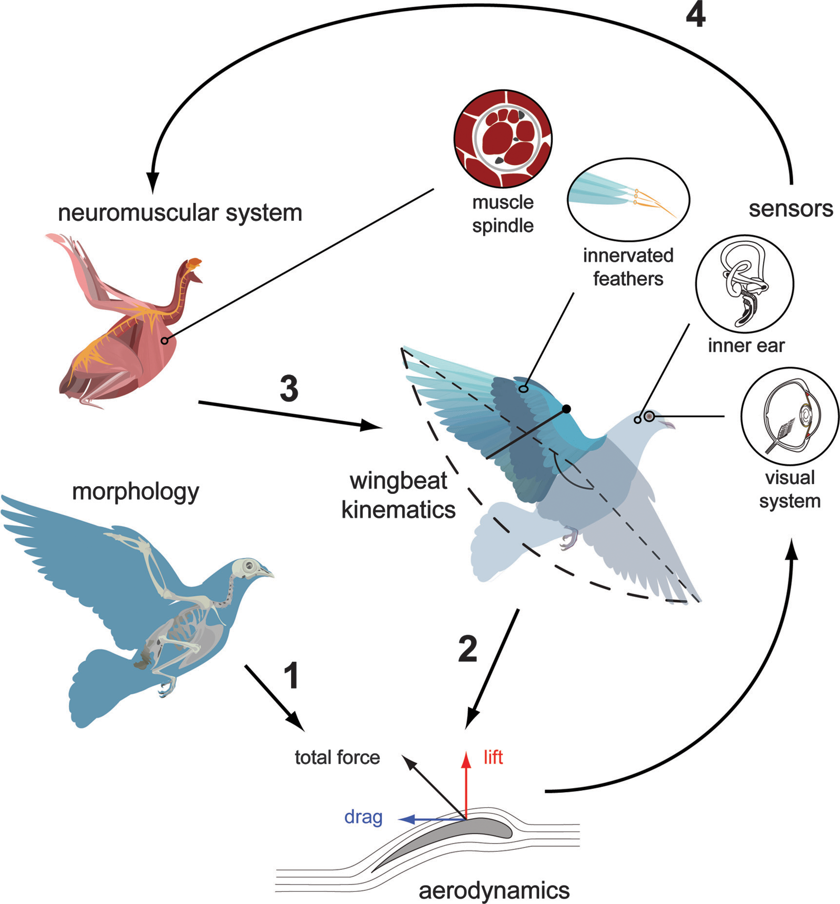

# Hummingbird Data
**(a blurb made public for my 2 favorite followers)**

Someday, I will have hummingbird data and possibly data on a few other birds as well, but right now I don't know what my project will be. I do know that I will be studying some aspect of vision as it relates to flight, I'm just not sure yet if I will be working on the neuro side of vision or the behavior side. For now, I will speculate briefly on both possibilities.

## How hummingbird neurons process visual stimuli

This would involve using single cell recording techniques on the neurons of the lentiformis mesencephali (LM), which is a visual structure involved in the optokinetic response and is hypertrophied in hummingbirds, to determine what types of visual stimulus they respond to and why. The process might look like this:

1. anesthetize wild caught Anna's hummingbirds (*Calypte anna*)
2. prop eye open
3. access LM and record neuron responses while presenting a variety of video stimulus:
    + dot field moving in various directions
    + dot field moving at various speeds
4. analyze neural response to every type and combination of stimuli
5. repeat 1-4 until sample size (neurons) is reached
6. steps 1-5 would be repeated in lab zebra finches (*Taeniopygia guttata*) for comparison
7. analyze similarities and differences between *Calypte* and *Taeniopygia*

Data produced would be neural recordings as related to video stimuli

## How visual stimuli influence hummingbird flight behavior

This would involve using a flight tunnel or similar construction with walls upon which visual stimuli are projected. Hummingbirds in free flight within the chamber would be recorded on several high speed cameras in order to capture data on their general flight patterns. The process might look like this:

1. acclimate wild caught Anna's hummingbirds (*Calypte anna*) to the flight chamber
2. program visual stimuli dependent on what we would like to measure. Possibilities include:
    + vertical gratings
    + horizontal gratings
    + looming spirals
    + expansion and contraction
3. capture video data on free flight with every type of stimuli
4. repeat for multiple hummingbirds dependent on sample size
5. analyze video data for individual similarities and differences
6. analyze video data for responses to each type of stimuli

Data produced would be free flight recordings as related to visual stimuli

## About the lab

[Altshuler Lab](http://altshuler.zoology.ubc.ca/index.html) in case you want to know more or heaven forbid, read some of our papers. Yours truly under personnel.

Fig. 1 Integrated, multilevel systems approach to the study of bird flight. Aerodynamic forces are influenced by wing shape and wing motion. The latter is actively controlled by the neuromuscular system, which is informed by a diverse sensory suite.

Altshuler Lab Review, 2015, The biophysics of bird flight, *Can. J. Zool.* Vol. 93, 961-975